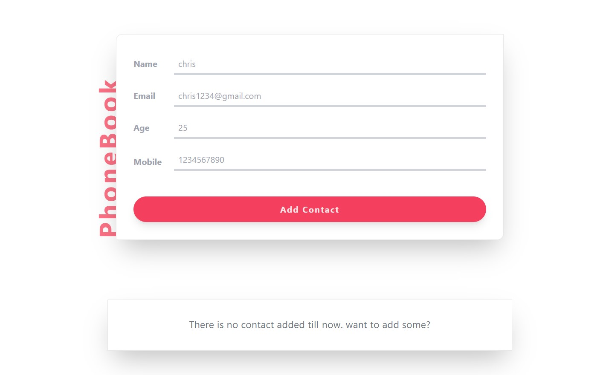
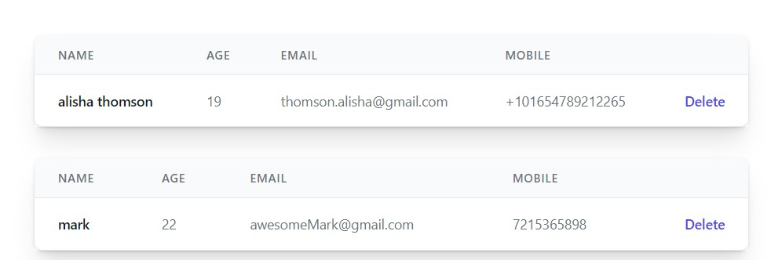
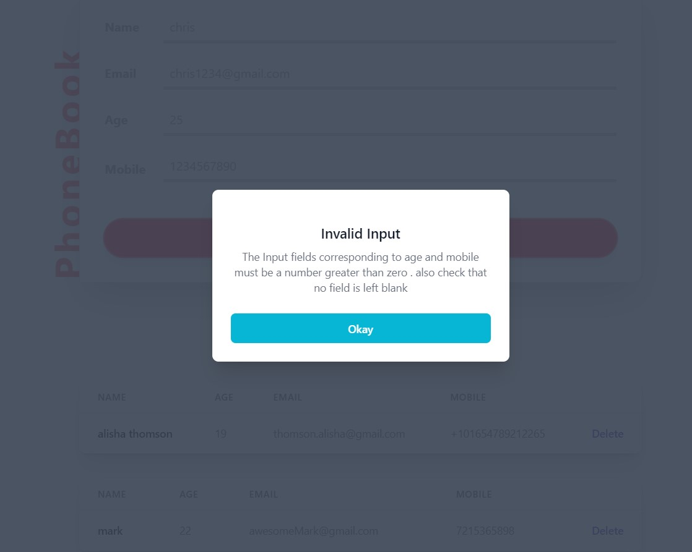

# about this minor react project:
this is a minor react project build to practice the fundamental react concepts . this project is a single page phonebook where a user can add contacts . below screenshot shows the basic layout of the project.

</img>

the added contacts will be shown below the form having a clean and clear UI. 

</img>

in more interactive feature added to this minor react project is that it consists of pop-up modals .

</img>